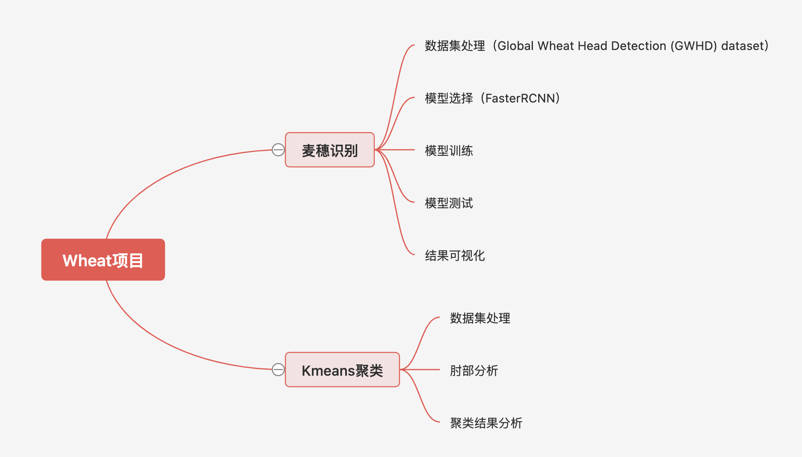
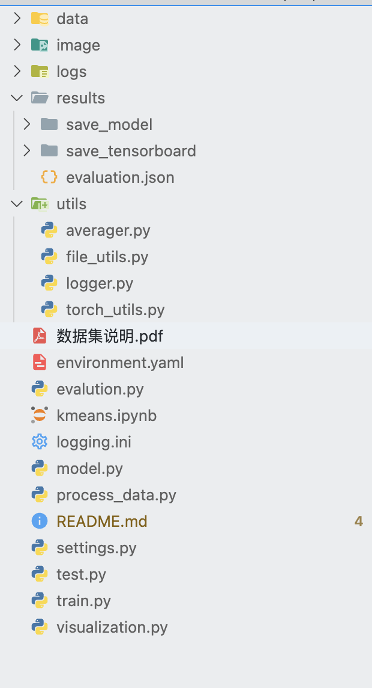
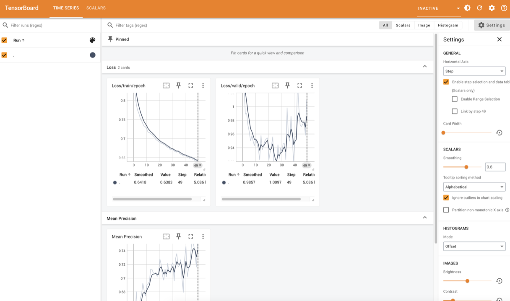

# 项目说明

# 代码结构

1. data文件夹放置数据相关文件
2. logs文件夹存放运行过程中产生的日志
3. results文件夹存放模型训练过程中保存的数据
4. utils文件夹保存相关的方法
   * averager.py文件用于计算平均数，本项目中用于计算loss
   * file_utils.py文件用于处理文件相关方法
   * logger.py文件用于配置logger
   * torch_utils.py文件用于pytorch的使用
5. evalution.py存放模型评估文件
6. kmeans.ipynb用于kmeans程序编写
7. model.py是模型文件
8. process_data.py用于数据集的处理
9. settings,py存放相关的配置
10. test.py存放测试代码
11. train.py执行测试操作
12. visualization.py执行可视化

# 启动项目

1. 使用虚拟环境安装相关的环境
   * 虚拟环境搭建参考[https://www.wolai.com/wyx-hhhh/xpALKfn8Nq9oTukJ5bPXNj](https://www.wolai.com/wyx-hhhh/xpALKfn8Nq9oTukJ5bPXNj)
   * 搭建完成后使用 `conda {env写自己的虚拟环境} create -f environment.yaml`
2. 启动可视化界面 `streamlit run visualization.py`
   
3. 模型训练可视化 `tensorboard --logdir /results/save_tensorboard --load_fast=false`
   ) 

# 注意事项

1. 以上命令均需要先安装好环境
2. 如果因为路径无法启动可以尝试绝对路径
3. 如果使用虚拟环境，需要确定输入命令的时候已经进入了虚拟环境
